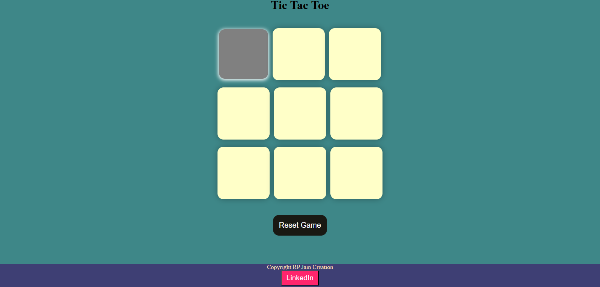

## Features

- **Responsive Design**: Enjoy the game on desktop, tablet, or mobile devices.
- **Winning Announcements**: Get immediate feedback on game outcomes with win, draw, and loss announcements.
- **Turn-Based Gameplay**: Take turns placing your 'X' or 'O' on the board until there's a winner or a draw.
- **Real-Time Updates**: The game board updates in real-time, ensuring a smooth and interactive gaming experience.

- ## How to Play

1. Visit the website.

2. Click on "Play Now" to start a new game.

3. Take turns placing your 'X' or 'O' on the grid. The game will notify you of the winner or a draw.

4. Have fun and enjoy the game!

## Technologies Used

- HTML, CSS, JavaScript

